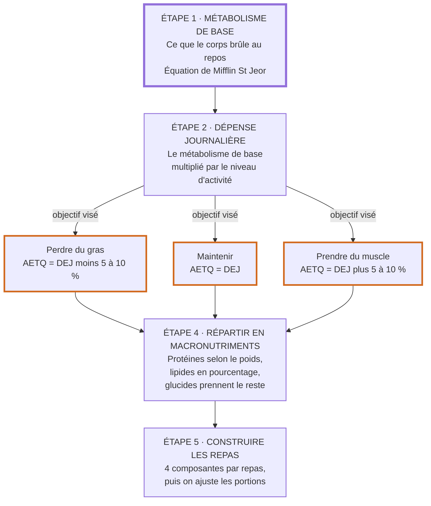
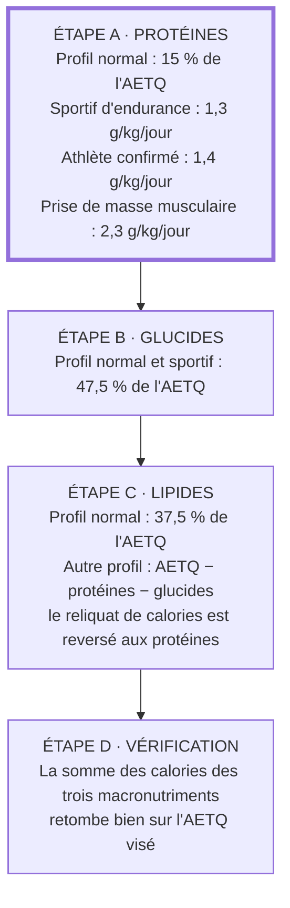

Bienvenue sur cette page où tu vas pouvoir apprendre comment et pourquoi réaliser un plan repas.

## Macronutriments et calories
On peut aisément simplifier l'alimentation d'un individu autour de 2 notions clés:

- Macronutriments: Ils sont les composants nutritifs d'une alimentation. Il existe 3 types de macronutriment: les protéines, les glucides (sucre) et les lipides (gras).

- Calories: Unité de mesure du potentiel énergétique. On peut faire le lien avec les macronutriments en notant que 1g de protéine vaut 4 calories, 1g de glucides vaut 4 calories et 1g de lipides vaut 9 calories.

Ici les macronutriments seront gages de la **qualité** de votre alimentation et les calories de la **quantité d'énergie** dans votre alimentation.

Il sera donc question de maintenir une bonne répartition dans ces macronutriments et de faire varier la quantité de calorie en fonction de si l'on souhaite faire une prise de masse ou une perte de poids.

En effet, l’épidémie d’obésité résulte d’un apport énergétique total quotidien (AETQ) excessif par rapport aux dépenses chez l’enfant comme chez l’adulte. La première recommandation majeure est donc, au sein de toutes les classes d’âge, de limiter les apports énergétiques (les calories) quelle que soit leur forme et d’augmenter la dépense énergétique (à savoir l'activité physique).

## Répartition des macronutriments
### Apport Protéines
Chez l’adulte en bonne santé, l'intervalle de référence est de **10 à 20 % de l’Apport Énergétique Total Quotidien (AETQ)**, le plafond de 20 % étant retenu « par prudence » (Anses 2016, p. 15/84). C'est cet intervalle en pourcentage qui s'applique par défaut, comme pour les deux autres macronutriments.

Cependant, il existe trois situation où on va raisonner en g/kg/jour quitte à sortir de la fourchette des 10-20 %  :

- Sportif d'endurance (1-2 h/jour durant 4-5 jours par semaine) : **1.2 à 1.4 g/kg/jour**.
- Athlète confirmé dans les disciplines de force : **1.3 à 1.5 g/kg/jour**.
- Prise de masse musculaire : **2 à 2.5 g/kg/jour**, mais pas durant plus de 6 mois.

Conséquence à assumer : quand cette cible dépasse 20 % de l'AETQ, il faut bien prendre la place quelque part. **Ce sont les lipides qui cèdent, pas les glucides.** L'Afssa écrit qu'« il est recommandé, en cas de restriction énergétique, de maintenir l'apport protéique » et que la couverture des besoins glucidiques reste prioritaire pour épargner la masse musculaire (Afssa 2007, p. 199). Les lipides sont donc la seule variable d'ajustement.

### Apport Glucides
Pour la population générale adulte, les glucides doivent représenter **40 à 55 % de l’Apport Énergétique Total Quotidien (AETQ)**.

La borne haute n'est pas cosmétique : « L'apport maximal en glucides est de 55 % dans la population générale adulte, valeur au-delà de laquelle les risques d'insulinorésistance, de diabète, de maladies cardiovasculaires et de certains cancers sont accrus » (Anses 2016, p. 65/84). Elle monte à 60 % chez les personnes à forte dépense énergétique, « pour couvrir le besoin énergétique à l'effort ».

### Apport lipides
La population générale et la population sportive n'ont pas le même intervalle :

- Population générale adulte : **35 à 40 %** de l’Apport Énergétique Total Quotidien (AETQ).
- Personnes à forte dépense énergétique (sportifs, travailleurs de force) : **30 à 35 %** de l'AETQ. C'est un intervalle décalé vers le bas, pour laisser la place aux glucides : leur maximum est 35 %, et non 40 %.

### Dans le temps
Il est à noter que les apports en glucides et protéines après l’effort sont déterminants pour éviter toute catalyse (destruction du muscle en vu de fournir des nutriments aux corps).

## Recommandation sur le mode de consommation des aliments
Un ensemble de recommandation sur la manière de repartir sa consommation de nourriture à été établi au sein des documents servant de base à cette page.

Les voici en 4 points:
- La consommation de nourriture doit se faire au sein de repas structurés (petit-déjeuner et goûter inclus) plutôt qu’en dehors des repas.

- La consommation des glucides doit se faire plutôt sous forme solide que liquide. En effet l’eau est la seule boisson indispensable, en particulier chez les jeunes enfants.

- Les repas principaux (déjeuner et dîner) doivent comporter **au moins quatre, au mieux cinq** composantes. L'Afssa en impose trois « à titre systématique » : un plat de **légumes**, des **produits céréaliers, pommes de terre ou légumes secs**, et un **fruit** (Afssa 2004, p. 102). 

- Le petit-déjeuner et le goûter doivent comporter un produit céréalier, un produit laitier, un fruit et une boisson.

## Exemple de plan repas
Afin de mettre en application l'ensemble des recommandations citées plus haut, il va être question de réaliser un plan repas. Pour faciliter les explications, je vous propose de passer par un exemple concret.
Attention, cela peut paraitre très contraignant de suivre un plan repas mais en réalité rien ne vous empêche de ne pas en tenir compte lors d'un repas par semaine (un restaurant entre ami par exemple), cela ne représenterait que 4 repas sur les 56 contenues dans un mois.

Voici le chemin complet, du corps au contenu de l'assiette:



### Détermination de l'apport Énergétique Total Quotidien (AETQ)
La première étape consiste à évaluer la quantité d'énergie dont vous avez besoin chaque jour.

1 - On calcule son métabolisme de base (**nombre de calorie consommé pour assurer nos fonctions vitales**)
Pour cela, on utilisera l’équation de Mifflin St Jeor:  

```python
MB_femmes =  (10 * poids_kg) + (6.25 * taille_cm) - (5 * age_annees) - 161
MB_hommes =  (10 * poids_kg) + (6.25 * taille_cm) - (5 * age_annees) + 5
```

Pour un homme de 21 ans, mesurant 1,83 m et pesant 80 kilos, cela donne :
```python
MB_hommes =  (10 * 80) + (6.25 * 183) - (5 * 21) + 5 = 1843.75
```

Soit un métabolisme de base de **1844 calories environ**.

2 - On calcule ensuite sa dépense énergétique journalière (cette fois si on inclut l'activité physique)

```python
DEJ = MB x NAP
```

Avec :
- NAP = 1.2 si vous êtes sédentaire (moins de 30 minutes d’activité physique par jour)
- NAP = 1.4 si vous êtes actif (1 heure d’activité physique par jour)
- NAP = 1.6 si vous êtes très actif (2 heures d’activité physique par jour)
- NAP = 1.8 si vous êtes extrêmement actif (métier physique et activité sportive en même temps, ou sportif en compétition)
- NAP ≥ 2.0 pour les dépenses énergétiques réellement élevées (travail de force à temps plein, entraînement sportif quotidien intensif)

Ici notre homme de 21 ans est actif et a un MB de 1844 calories comme déterminé précédemment.

```python
DEJ = MB * NAP = 1844 * 1.4 = 2581.6
```

Soit une dépense énergétique journalière de **2582 calories environ**.

3 - On calcule l'apport énergétique total quotidien

- Pour perdre du gras : AETQ < DEJ  (coef entre 5% à 10% de diminution de l’AETQ initial)
- Pour maintenir votre composition corporelle :  AETQ = DEJ (coef = 1)
- Pour prendre de la masse musculaire : AETQ > DEJ (coef entre 5% à 10% d’augmentation de l’AETQ initial)

Ici notre homme de 21 ans souhaite perdre du gras (et a souvent du mal à y arriver donc on va faire une diminution de 20%).
```python
AETQ = DEJ * coeff =  2582 * (1-0.2) = 2065.6
```

À noter : Si jamais l'effet sur le corps n'est pas celui souhaité (après analyse de son poids), vous pouvez réduire ou augmenter de 200 calories votre AETQ.

Conclusion : On a donc désormais une idée précise du nombre de calorie que l'on doit ingérer chaque jour pour atteindre notre objectif.

### Détermination du nombre de gramme de chaque macronutriment chaque jour
On sert les trois macronutriments dans cet ordre : les protéines d'abord parce qu'elles dépendent de votre poids et non de vos calories si vous êtes sportifs, les lipides ensuite parce qu'ils ont un plancher à tenir, les glucides en dernier parce que ce sont eux qui bouclent le budget.



Les trois pourcentages retenus ci-dessus sont les milieux des fourchettes établies plus haut : 15 % pour les protéines (10-20 %), 47,5 % pour les glucides (40-55 %) et 37,5 % pour les lipides (35-40 %). Ils tombent exactement sur 100 %, ce qui en fait le point de départ par défaut. Rappel : 1 g de protéines et 1 g de glucides valent 4 calories, 1 g de lipides en vaut 9.

1 - On calcule les protéines

C'est le seul macronutriment qui peut se calculer à partir du poids plutôt qu'à partir des calories, il passe donc en premier.

```python
# Profil normal : on part du pourcentage de l'AETQ
proteines_kcal = AETQ * 0.15
proteines_g    = proteines_kcal / 4

# Sportif : on part du poids, le pourcentage devient une conséquence
proteines_g    = coeff_g_par_kg * poids_kg   # 1.3 endurance, 1.4 force, 2.3 prise de masse
proteines_kcal = proteines_g * 4
```

Notre homme de 21 ans a un AETQ de 2066 calories et n'entre dans aucune des trois situations sportives, on lui applique donc le profil normal.

```python
proteines_kcal = 2066 * 0.15 = 309.9
proteines_g    = 309.9 / 4 = 77.475
```

2 - On calcule les glucides

```python
glucides_kcal = AETQ * 0.475
glucides_g    = glucides_kcal / 4
```

```python
glucides_kcal = 2066 * 0.475 = 981.35
glucides_g    = 981.35 / 4 = 245.3
```

Soit **245 g de glucides environ**.

3 - On calcule les lipides

Pour un profil normal, on applique le pourcentage. Pour tous les autres, les lipides ne se calculent pas : ils encaissent ce qui reste, conformément au principe posé plus haut (ce sont les lipides qui cèdent, pas les glucides).

```python
# Profil normal
lipides_kcal = AETQ * 0.375

# Autre profil : les lipides sont le solde
lipides_kcal = AETQ - proteines_kcal - glucides_kcal

lipides_g = lipides_kcal / 9
```

```python
lipides_kcal = 2066 * 0.375 = 774.75
lipides_g    = 774.75 / 9 = 86.08
```

Soit **86 g de lipides environ**.

4 - On vérifie

On repart des grammes arrondis et on refait la somme des calories : elle doit retomber sur l'AETQ visé.

```python
total = (77 * 4) + (245 * 4) + (86 * 9) = 308 + 980 + 774 = 2062
ecart = 2066 - 2062 = 4
```

Il manque 4 calories, uniquement dues aux arrondis.

Conclusion : on connaît maintenant non seulement le nombre de calories quotidien, mais aussi les grammes de protéines, de glucides et de lipides à répartir dans la journée. Ce sont ces trois chiffres que le plan repas doit atteindre.

### Le plan repas
Maintenant, il est question de réaliser le plan repas en lui même.

L'important est d'avoir un petit-déjeuner et goûter composés de 4 éléments (un produit céréalier, un produit laitier, un fruit et une boisson).
Ainsi qu'un déjeuner et un dîner composés d'au moins 4 éléments, au mieux 5 (légumes, produits céréaliers ou pommes de terre ou légumes secs, un fruit — les trois composantes systématiques de l'Afssa — plus une source de protéines propre à ce plan).

Une fois votre plan repas constitué de tout ces éléments: retrouvez le nombre de calories qu'ils contiennent grâce à [les-calories.com](https://www.les-calories.com/), via l'étiquette inscrite sur ceux-ci ou le site du drive de votre supermarché.

Il ne vous reste plus qu'à calculer la quantité de macronutriment et de calories de l'ensemble et à adapter les portions (un écart de 50 calories étant tolérable).


## Source
- Agence française de sécurité sanitaire des aliments (Afssa), *Apport en protéines : consommation, qualité, besoins et recommandations*, 2007 ([lire en ligne](https://www.anses.fr/fr/system/files/NUT-Ra-Proteines.pdf)).

- Agence française de sécurité sanitaire des aliments (Afssa), *Glucides et santé : Etat des lieux, évaluation et recommandations*, Octobre 2004 ([lire en ligne](https://www.anses.fr/fr/system/files/NUT-Ra-Glucides.pdf)).

- Agence nationale de sécurité sanitaire de l’alimentation, de l’environnement et du travail (Anses), *Actualisation des apports nutritionnels conseillés pour les acides gras*, Mai 2011 ([lire en ligne](https://www.anses.fr/fr/system/files/NUT2006sa0359Ra.pdf)).

- DECATHLON Blog, *Les méthodes de calcul du métabolisme de base* ([lire en ligne](https://conseilsport.decathlon.fr/les-methodes-de-calcul-du-metabolisme-de-base)).

- Agence nationale de sécurité sanitaire de l’alimentation, de l’environnement et du travail (Anses), *Actualisation des repères du PNNS : contribution des macronutriments à l'apport énergétique*, saisine 2012-SA-0186, Novembre 2016 ([lire en ligne](https://www.anses.fr/fr/system/files/NUT2012SA0103Ra-2.pdf)). C'est ce rapport qui fixe les fourchettes en pourcentage de l'AETQ utilisées ici : protéines 10 à 20%, lipides 35 à 40% (30 à 35% chez les personnes à forte dépense énergétique), glucides 40 à 55% (50 à 60% chez ces mêmes personnes). Il valide également l'équation de Mifflin St Jeor, retenue comme l'une des cinq équations de métabolisme de base jugées satisfaisantes de manière équivalente.
